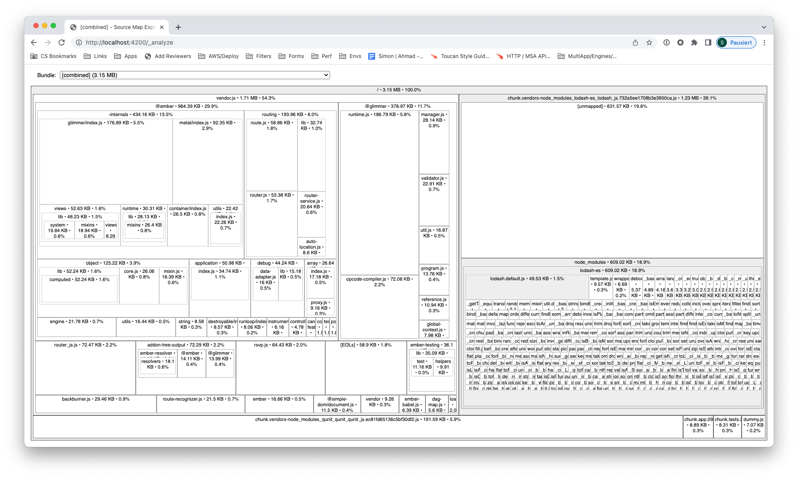

ember-cli-bundle-analyzer
==============================================================================

[](https://travis-ci.org/kaliber5/ember-cli-bundle-analyzer)
[](https://emberobserver.com/addons/ember-cli-bundle-analyzer)
[](https://badge.fury.io/js/ember-cli-bundle-analyzer)

An Ember CLI addon to analyze the size and contents of your app's bundled output, 
using an interactive zoomable treemap.

View the [interactive Demo](https://cdn.rawgit.com/kaliber5/ember-cli-bundle-analyzer/bceb55a7/docs/demo.html)



This helps you to

* analyze which individual modules make it into your final bundle
* find out how big each contained module is, including the raw source, minified and gzipped sizes
* find modules that got there by mistake
* optimize your bundle size


It uses [broccoli-concat-analyser](https://github.com/stefanpenner/broccoli-concat-analyser) under the hood,
which in turn was inspired by 
[webpack-bundle-analyzer](https://github.com/webpack-contrib/webpack-bundle-analyzer),
and wraps it in Ember CLI addon to make it easy to use.

Compatibility
------------------------------------------------------------------------------

* Ember CLI v2.13 or above
* Node.js v8 or above

Installation
------------------------------------------------------------------------------

```
ember install ember-cli-bundle-analyzer
```

Usage
------------------------------------------------------------------------------

After you have started your development server using `ember serve`, this addon adds a custom middleware listening to
`/_analyze`. So just open `http://localhost:4200/_analyze` in your web browser to access the analyzer output.

While it processes the data, which can take a while due to live minification and compression of all involved modules, 
a loading screen is displayed. After processing has finished you should see the final output.

Live reloading is supported, so whenever you change a project file the output will be re-computed and updated.

### Options

You can customize the precessing by setting any of the following options into the `'bundle-analyzer'` key of your
`ember-cli-build.js`:

* `ignoreTestFiles` (boolean): by default it will exclude all test files from the output. Set this to `false` to include
them.

* `ignore` (string | string[]): add files to ignore. Glob patterns are supported, e.g. `*-fastboot.js`.

Contributing
------------------------------------------------------------------------------

See the [Contributing](CONTRIBUTING.md) guide for details.

License
------------------------------------------------------------------------------

This project is licensed under the [MIT License](LICENSE.md).
